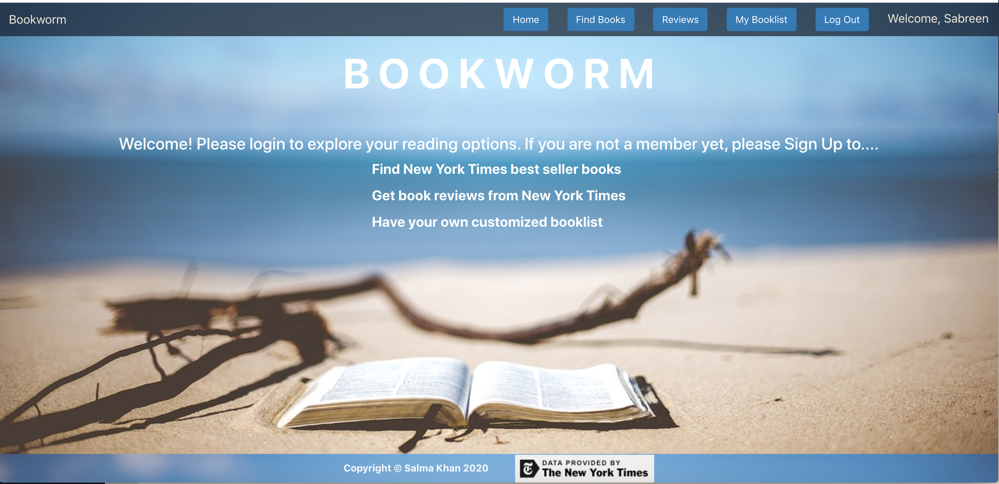

# Bookworm

Created By | Last Updated
-----------|--------------
Salma Khan | January 24, 2020

Bookworm is a Full Stack MERN web-based application where users can find the New York Times best seller's books along with book reviews. The books can be searched by their title, author, isbn, or the lists under which New York Times catagorized the books. If the users like the book / review, they will be able to create their own personalized booklist or be able to purchase the book from Amazon. 

## User Stories
* As a user (AAU), when I browse the page, I should be able to see the “Home” page with a description of the app and how to use it. 
    * AAU, I should also be able to see a navigation bar with links on top as well. 
* As a user, I want to have the ability to Sign-up for the app if I am not a member yet. If I am a member, I should be able to “Login” to have access to its functionality & “Log Out” when I am done using the application.
* As a user, I should have restricted authorization to certain functionality prior to signing up or logging in to the app.
* AAU, I want to be able to get book reviews from New York Times by searching book title, author, or the ISBN number in the "Reviews" page.
* AAU, I want to be able to get a list of New York Times best sellers book by searching their list name in the "Find Books" page.
    * AAU, I want to be able to see the names of all the lists that New York Times uses to categorize their best sellers book into by clicking a button called "Find List Names Here".
    * AAU, I want to be able to have a link where I can go to purchase the book. 
* AAU, in the "Find Books" or "Reviews" page, I want to have the ability to add the books I like in "My Booklist" so that I can read it later.
* AAU, I should be able to see a list of all the books I have added in the “My Booklist” page.
* AAU, I want to be able to remove books from my booklist when I am done reading them.

## Technologies Used
 * React
 * Expres.js
 * Node.js
 * Mongoose
 * MongoDB 
 * MongoDB Atlas 
 * REST API
 * HTML
 * CSS
 * Token-based Authentication with React & JWTs

 ## Third Party API
 * New York Times: [Click here to learn more](https://developer.nytimes.com/)
 

## Project Planning
* Trello Board includes both wireframe & Entity-Relationship-Diagram (ERD): [Bookworm](https://trello.com/b/9kAnNtlV/bookworm-mern-stack)

## Unsolved Problem
* Implement responsive web design on the app so that it can be used from variety of devices and window or screen sizes.

## Deployed on Heroku
[Check out Bookworm here!](https://bookwormssk.herokuapp.com/)

## Future Enhancements
* You can expand the project by creating a "Libraries" page where you can have multiple libraries containing books based on genre, author etc. 
* You can also add a new page called “Add  My Reviews” where you will be able to write your own reviews of the books once you are done reading them. 
